# Enterprise AI Application Platform Architecture Document

## Introduction

This document outlines the overall project architecture for Enterprise AI Application Platform, including backend systems, shared services, and non-UI specific concerns. Its primary goal is to serve as the guiding architectural blueprint for AI-driven development, ensuring consistency and adherence to chosen patterns and technologies.

**Relationship to Frontend Architecture:**
The project includes a significant user interface with React/TypeScript frontend. This document covers the complete full-stack architecture including frontend-specific design patterns. Core technology stack choices documented herein are definitive for the entire project.

### Starter Template or Existing Project

**Decision**: Utilizing existing Replit full-stack template with React/TypeScript + Express.js
**Rationale**: The project is built on Replit's integrated development environment with pre-configured tooling including:
- React + TypeScript frontend with Vite bundling
- Express.js + TypeScript backend with thin API layer
- Shadcn UI component system with Tailwind CSS
- Drizzle ORM with MemStorage → PostgreSQL migration path
- Replit Auth integration for enterprise security

### Change Log

| Date | Version | Description | Author |
|------|---------|-------------|---------|
| 2025-09-18 | 1.0 | Initial Architecture Document | Winston (Architect) |

## High Level Architecture

### Technical Summary

The Enterprise AI Application Platform employs a **monolithic full-stack architecture** with thin backend pattern optimized for rapid development and <15 minute deployment capabilities. The system uses React/TypeScript for frontend-heavy business logic, Express.js as a minimal API layer, and MemStorage for MVP persistence with clear PostgreSQL migration path. Core architectural patterns include Repository Pattern for data abstraction, AI Service Layer for multi-model integration, and Progressive Web App patterns for enterprise user experience. This architecture directly supports PRD goals of 90% development acceleration, <200ms API response times, and Fortune 500 enterprise adoption through a scalable, secure foundation.

### High Level Overview

**1. Main Architectural Style**: Monolithic Full-Stack Application with Thin Backend Pattern

**2. Repository Structure**: Single-service monorepo with clear frontend/backend separation

**3. Service Architecture**: Unified full-stack application with the following layers:
   - **Presentation Layer**: React/TypeScript with Shadcn UI components
   - **Business Logic Layer**: Frontend-heavy with React state management
   - **API Layer**: Thin Express.js backend for data persistence and AI orchestration
   - **Data Layer**: MemStorage for MVP, PostgreSQL migration path for enterprise scaling
   - **Integration Layer**: Replit Auth, OpenAI API, WebSocket for real-time features

**4. Primary User Flow**: 
   - User authentication via Replit Auth → Role-based progressive onboarding → Industry template discovery → AI-assisted configuration → Visual workflow building → Zero-shot application deployment

**5. Key Architectural Decisions**:
   - **Frontend-Heavy Architecture**: Business logic in React to minimize backend complexity and API calls
   - **MemStorage for MVP**: Non-durable in-memory persistence acceptable for demos with clear migration path
   - **Multi-Model AI Integration**: OpenAI primary with streaming capabilities for real-time chat
   - **Progressive Onboarding**: Role-based paths (Business/Technical) to eliminate feature overwhelm

### High Level Project Diagram

```mermaid
graph TB
    User[👤 User] --> Auth[🔐 Replit Auth]
    User --> Frontend[🌐 React Frontend]
    
    Frontend --> API[⚡ Express API]
    Frontend --> WebSocket[🔄 WebSocket Server]
    Frontend --> Storage[💾 Browser Storage]
    
    API --> MemStore[(📝 MemStorage)]
    API --> AI[🤖 AI Service Layer]
    
    AI --> OpenAI[🧠 OpenAI GPT-4]
    AI --> Streaming[📡 Streaming Response]
    
    WebSocket --> RealTime[⚡ Real-time Updates]
    
    MemStore --> Migration[➡️ PostgreSQL Migration Path]
    
    subgraph "External Integrations"
        Auth
        OpenAI
    end
    
    subgraph "Client Side"
        User
        Frontend
        Storage
    end
    
    subgraph "Server Side"
        API
        WebSocket
        MemStore
        AI
        Streaming
        RealTime
    end
```



### Architectural and Design Patterns

- **Monolithic Full-Stack Pattern**: Single deployable unit with clear layer separation - *Rationale:* Maximizes development velocity for MVP and supports <15 minute deployment target
- **Thin Backend Pattern**: Frontend handles most business logic, backend focuses on persistence and AI integration - *Rationale:* Reduces API calls and latency while enabling complex UI interactions
- **Repository Pattern**: Abstract data access layer enabling MemStorage → PostgreSQL migration - *Rationale:* Provides testability and future database flexibility without architectural changes
- **Service Layer Pattern**: AI orchestration service managing OpenAI integration and streaming - *Rationale:* Encapsulates AI complexity and enables multi-model support
- **Progressive Web App Pattern**: Frontend optimized for enterprise desktop/tablet experiences - *Rationale:* Supports Fortune 500 user requirements and offline capability roadmap

## Tech Stack

### Cloud Infrastructure
- **Provider:** Replit Platform
- **Key Services:** Replit Auth, Object Storage, Secrets Management, Deployment Infrastructure
- **Deployment Regions:** Global via Replit's CDN

### Technology Stack Table

| Category | Technology | Version | Purpose | Rationale |
|----------|------------|---------|---------|-----------|
| **Language** | TypeScript | 5.3.3 | Primary development language | Strong typing, excellent tooling, enterprise-grade reliability |
| **Runtime** | Node.js | 20.11.0 | JavaScript runtime | LTS version, stable performance, wide ecosystem |
| **Frontend Framework** | React | 18.2.0 | User interface library | Enterprise adoption, component reusability, AI-friendly patterns |
| **Backend Framework** | Express.js | 4.18.2 | Thin API layer | Minimal overhead, fast setup, wide TypeScript support |
| **Build Tool** | Vite | 5.1.0 | Frontend bundling and dev server | Fast HMR, optimized builds, excellent TypeScript integration |
| **UI Framework** | Shadcn UI | Latest | Component system | Enterprise-ready components, Tailwind integration, accessibility |
| **Styling** | Tailwind CSS | 3.4.0 | Utility-first CSS framework | Rapid UI development, consistent design system, responsive design |
| **ORM** | Drizzle ORM | Latest | Type-safe database queries | TypeScript-first, migration support, MemStorage → PostgreSQL path |
| **Authentication** | Replit Auth | Latest | Enterprise authentication | Zero-config OAuth, enterprise security, multiple provider support |
| **State Management** | React Query | 5.0.0 | Server state management | Caching, optimistic updates, background sync |
| **Routing** | Wouter | 3.0.0 | Client-side routing | Lightweight, hook-based, perfect for SPA |
| **AI Integration** | OpenAI SDK | 4.28.0 | AI model interaction | Streaming support, function calling, enterprise-grade reliability |
| **WebSocket** | ws | 8.16.0 | Real-time communication | Native WebSocket support, streaming AI responses |
| **Testing** | Vitest | 1.3.0 | Unit testing framework | Fast, TypeScript native, Vite integration |
| **Storage (MVP)** | MemStorage | Custom | In-memory persistence | Rapid prototyping, acceptable data loss for MVP demos |
| **Storage (Production)** | PostgreSQL | 15+ | Persistent database | ACID compliance, JSON support, enterprise-grade reliability |

## Data Models

### User

**Purpose:** Core user entity supporting role-based onboarding and personalized experience

**Key Attributes:**
- id: string - Unique identifier from Replit Auth
- email: string - User email address
- profile: object - User profile information (name, avatar, preferences)
- role: enum - User role (business_user | technical_user)
- industry: string - Selected industry (healthcare | finance | ecommerce)
- onboardingCompleted: boolean - Onboarding completion status
- preferences: object - User preferences and settings

**Relationships:**
- One-to-many with Templates (saved/favorited templates)
- One-to-many with Projects (created applications)
- One-to-many with ChatSessions (AI conversation history)

### Template

**Purpose:** Industry-specific application templates with ratings and ROI metrics

**Key Attributes:**
- id: string - Unique template identifier
- name: string - Template display name
- industry: enum - Target industry (healthcare | finance | ecommerce)
- description: string - Template description
- rating: number - Average user rating (1-5 stars)
- usageCount: number - Number of deployments
- roiMetrics: object - ROI demonstration data
- configuration: object - Template configuration schema
- complianceInfo: array - Compliance certifications

**Relationships:**
- Many-to-many with Users (favorites, ratings)
- One-to-many with Projects (instantiated applications)
- Many-to-one with TemplateCategory

### Project

**Purpose:** User-created applications generated from templates or workflows

**Key Attributes:**
- id: string - Unique project identifier
- userId: string - Owner user ID
- templateId: string - Source template ID (if applicable)
- name: string - Project name
- status: enum - Project status (draft | deploying | deployed | error)
- configuration: object - Project configuration and customizations
- deploymentUrl: string - Live application URL
- createdAt: date - Creation timestamp

**Relationships:**
- Many-to-one with User (owner)
- Many-to-one with Template (source template)
- One-to-many with ChatSessions (project-specific AI conversations)

### ChatSession

**Purpose:** AI conversation history with context preservation

**Key Attributes:**
- id: string - Unique session identifier
- userId: string - User ID
- projectId: string - Associated project (optional)
- messages: array - Conversation message history
- context: object - Session context and state
- model: enum - AI model used (gpt-4 | claude)
- sessionType: enum - Session type (onboarding | template_config | workflow_builder)

**Relationships:**
- Many-to-one with User
- Many-to-one with Project (optional)

## Components

### Frontend Application (React/TypeScript)

**Responsibility:** Primary user interface handling business logic, state management, and user interactions

**Key Interfaces:**
- Authentication management via Replit Auth integration
- Real-time AI chat interface with streaming responses
- Progressive onboarding wizard with role-based paths
- Industry template gallery with search and filtering
- Visual workflow builder with drag-drop capabilities
- Analytics dashboard with KPI tracking

**Dependencies:** Express API, WebSocket Server, Replit Auth, Browser Storage

**Technology Stack:** React 18.2, TypeScript 5.3, Shadcn UI, Tailwind CSS, React Query, Wouter routing

### Express API Server

**Responsibility:** Thin backend API layer for data persistence, AI orchestration, and external integrations

**Key Interfaces:**
- RESTful API endpoints for CRUD operations
- AI model integration with streaming support
- User authentication and session management
- Template and project management
- Analytics data aggregation

**Dependencies:** MemStorage, OpenAI API, Replit Auth

**Technology Stack:** Express.js 4.18, TypeScript 5.3, Drizzle ORM, Custom MemStorage implementation

### AI Service Layer

**Responsibility:** Multi-model AI integration with streaming capabilities and function calling

**Key Interfaces:**
- OpenAI GPT-4 integration with streaming responses
- AI conversation management and context preservation
- Function calling for workflow automation
- Model selection and failover logic

**Dependencies:** OpenAI API, Chat Session storage

**Technology Stack:** OpenAI SDK 4.28, Custom streaming implementation, WebSocket integration

### WebSocket Server

**Responsibility:** Real-time communication for AI streaming responses and collaborative features

**Key Interfaces:**
- AI response streaming to frontend
- Real-time updates for deployment status
- Collaborative editing capabilities (future)

**Dependencies:** Express API Server, AI Service Layer

**Technology Stack:** ws 8.16, Custom WebSocket message handling

### MemStorage Service

**Responsibility:** In-memory data persistence for MVP with migration interfaces

**Key Interfaces:**
- Type-safe repository interfaces for all data models
- Session-based data persistence
- Migration utilities for PostgreSQL transition
- Data validation and sanitization

**Dependencies:** None (standalone in-memory implementation)

**Technology Stack:** Custom TypeScript implementation, Drizzle schema definitions

### Component Diagrams


## External APIs

### OpenAI API

- **Purpose:** Multi-model AI integration for chat, code generation, and workflow automation
- **Documentation:** https://platform.openai.com/docs/api-reference
- **Base URL(s):** https://api.openai.com/v1
- **Authentication:** Bearer token via OPENAI_API_KEY secret
- **Rate Limits:** 500 requests/minute, 150k tokens/minute (adjustable based on tier)

**Key Endpoints Used:**
- `POST /chat/completions` - AI chat with streaming support for user interactions
- `POST /assistants` - AI assistants for specialized template configuration
- `POST /threads` - Conversation thread management for context preservation

**Integration Notes:** Streaming responses via WebSocket, function calling for workflow automation, context preservation across sessions

### Replit Auth API

- **Purpose:** Enterprise-grade authentication and user management
- **Documentation:** Replit Auth integration documentation
- **Base URL(s):** Managed by Replit platform
- **Authentication:** OAuth 2.0 with automatic token management
- **Rate Limits:** Platform managed, enterprise-grade availability

**Key Endpoints Used:**
- OAuth authorization flow with callback handling
- User profile information retrieval
- Session management and token refresh

**Integration Notes:** Zero-configuration setup, supports multiple OAuth providers, enterprise security compliance

## Core Workflows

### User Onboarding Workflow


### Template Configuration Workflow


## REST API Spec

```yaml
openapi: 3.0.0
info:
  title: Enterprise AI Application Platform API
  version: 1.0.0
  description: Backend API for AI-powered application platform
servers:
  - url: http://localhost:5000/api
    description: Development server

paths:
  /auth/callback:
    get:
      summary: Replit Auth callback handler
      responses:
        '302':
          description: Redirect to dashboard after successful authentication
  
  /user/profile:
    get:
      summary: Get current user profile
      security:
        - bearerAuth: []
      responses:
        '200':
          description: User profile data
          content:
            application/json:
              schema:
                $ref: '#/components/schemas/User'
    
    patch:
      summary: Update user profile
      security:
        - bearerAuth: []
      requestBody:
        content:
          application/json:
            schema:
              type: object
              properties:
                role:
                  type: string
                  enum: [business_user, technical_user]
                industry:
                  type: string
                preferences:
                  type: object
      responses:
        '200':
          description: Updated user profile
  
  /templates:
    get:
      summary: Get template gallery
      parameters:
        - name: industry
          in: query
          schema:
            type: string
            enum: [healthcare, finance, ecommerce]
        - name: role
          in: query
          schema:
            type: string
            enum: [business_user, technical_user]
      responses:
        '200':
          description: Array of templates
          content:
            application/json:
              schema:
                type: array
                items:
                  $ref: '#/components/schemas/Template'
  
  /templates/{id}:
    get:
      summary: Get template details
      parameters:
        - name: id
          in: path
          required: true
          schema:
            type: string
      responses:
        '200':
          description: Template details
          content:
            application/json:
              schema:
                $ref: '#/components/schemas/Template'
  
  /projects:
    get:
      summary: Get user projects
      security:
        - bearerAuth: []
      responses:
        '200':
          description: Array of user projects
          content:
            application/json:
              schema:
                type: array
                items:
                  $ref: '#/components/schemas/Project'
    
    post:
      summary: Create new project
      security:
        - bearerAuth: []
      requestBody:
        content:
          application/json:
            schema:
              type: object
              required:
                - name
                - templateId
              properties:
                name:
                  type: string
                templateId:
                  type: string
                configuration:
                  type: object
      responses:
        '201':
          description: Created project
          content:
            application/json:
              schema:
                $ref: '#/components/schemas/Project'
  
  /projects/{id}/deploy:
    post:
      summary: Deploy project application
      security:
        - bearerAuth: []
      parameters:
        - name: id
          in: path
          required: true
          schema:
            type: string
      responses:
        '200':
          description: Deployment initiated
          content:
            application/json:
              schema:
                type: object
                properties:
                  status:
                    type: string
                  deploymentUrl:
                    type: string
  
  /chat/sessions:
    post:
      summary: Create AI chat session
      security:
        - bearerAuth: []
      requestBody:
        content:
          application/json:
            schema:
              type: object
              properties:
                projectId:
                  type: string
                sessionType:
                  type: string
                  enum: [onboarding, template_config, workflow_builder]
      responses:
        '201':
          description: Created chat session
          content:
            application/json:
              schema:
                $ref: '#/components/schemas/ChatSession'

components:
  securitySchemes:
    bearerAuth:
      type: http
      scheme: bearer
      bearerFormat: JWT
  
  schemas:
    User:
      type: object
      properties:
        id:
          type: string
        email:
          type: string
        profile:
          type: object
        role:
          type: string
          enum: [business_user, technical_user]
        industry:
          type: string
        onboardingCompleted:
          type: boolean
        preferences:
          type: object
    
    Template:
      type: object
      properties:
        id:
          type: string
        name:
          type: string
        industry:
          type: string
        description:
          type: string
        rating:
          type: number
        usageCount:
          type: number
        roiMetrics:
          type: object
        configuration:
          type: object
        complianceInfo:
          type: array
    
    Project:
      type: object
      properties:
        id:
          type: string
        userId:
          type: string
        templateId:
          type: string
        name:
          type: string
        status:
          type: string
          enum: [draft, deploying, deployed, error]
        configuration:
          type: object
        deploymentUrl:
          type: string
        createdAt:
          type: string
          format: date-time
    
    ChatSession:
      type: object
      properties:
        id:
          type: string
        userId:
          type: string
        projectId:
          type: string
        messages:
          type: array
        context:
          type: object
        model:
          type: string
          enum: [gpt-4, claude]
        sessionType:
          type: string
```

## Implementation-Ready Specifications

### Shared Schema Definition (shared/schema.ts)

```typescript
import { z } from 'zod';
import { createInsertSchema } from 'drizzle-zod';

// Drizzle table definitions
export const users = {
  id: string,
  email: string,
  profile: object,
  role: string,
  industry: string,
  onboardingCompleted: boolean,
  preferences: object,
  createdAt: Date
};

export const templates = {
  id: string,
  name: string,
  industry: string,
  description: string,
  rating: number,
  usageCount: number,
  roiMetrics: object,
  configuration: object,
  complianceInfo: array,
  createdAt: Date
};

export const projects = {
  id: string,
  userId: string,
  templateId: string,
  name: string,
  status: string,
  configuration: object,
  deploymentUrl: string,
  createdAt: Date,
  updatedAt: Date
};

export const chatSessions = {
  id: string,
  userId: string,
  projectId: string,
  messages: array,
  context: object,
  model: string,
  sessionType: string,
  createdAt: Date,
  lastActivity: Date
};

// Drizzle-zod insert schemas
export const insertUserSchema = createInsertSchema(users).omit({ id: true, createdAt: true });
export const insertTemplateSchema = createInsertSchema(templates).omit({ id: true, createdAt: true });
export const insertProjectSchema = createInsertSchema(projects).omit({ id: true, createdAt: true, updatedAt: true });
export const insertChatSessionSchema = createInsertSchema(chatSessions).omit({ id: true, createdAt: true, lastActivity: true });

// Insert and select types
export type InsertUser = z.infer<typeof insertUserSchema>;
export type SelectUser = typeof users.$inferSelect;
export type InsertTemplate = z.infer<typeof insertTemplateSchema>;
export type SelectTemplate = typeof templates.$inferSelect;
export type InsertProject = z.infer<typeof insertProjectSchema>;
export type SelectProject = typeof projects.$inferSelect;
export type InsertChatSession = z.infer<typeof insertChatSessionSchema>;
export type SelectChatSession = typeof chatSessions.$inferSelect;
```

### Storage Interface (server/storage.ts)

```typescript
import { InsertUser, SelectUser, InsertTemplate, SelectTemplate, InsertProject, SelectProject, InsertChatSession, SelectChatSession } from '@shared/schema';

export interface IStorage {
  // User operations
  createUser(user: InsertUser): Promise<SelectUser>;
  getUserById(id: string): Promise<SelectUser | null>;
  getUserByEmail(email: string): Promise<SelectUser | null>;
  updateUser(id: string, updates: Partial<InsertUser>): Promise<SelectUser>;
  deleteUser(id: string): Promise<boolean>;
  
  // Template operations
  createTemplate(template: InsertTemplate): Promise<SelectTemplate>;
  getTemplateById(id: string): Promise<SelectTemplate | null>;
  getTemplatesByIndustry(industry: string): Promise<SelectTemplate[]>;
  searchTemplates(query: string): Promise<SelectTemplate[]>;
  updateTemplate(id: string, updates: Partial<InsertTemplate>): Promise<SelectTemplate>;
  
  // Project operations
  createProject(project: InsertProject): Promise<SelectProject>;
  getProjectById(id: string): Promise<SelectProject | null>;
  getProjectsByUserId(userId: string): Promise<SelectProject[]>;
  updateProject(id: string, updates: Partial<InsertProject>): Promise<SelectProject>;
  deleteProject(id: string): Promise<boolean>;
  
  // Chat session operations
  createChatSession(session: InsertChatSession): Promise<SelectChatSession>;
  getChatSessionById(id: string): Promise<SelectChatSession | null>;
  getChatSessionsByUserId(userId: string): Promise<SelectChatSession[]>;
  updateChatSession(id: string, updates: Partial<InsertChatSession>): Promise<SelectChatSession>;
  deleteChatSession(id: string): Promise<boolean>;
}

export class MemStorage implements IStorage {
  private users: Map<string, SelectUser> = new Map();
  private templates: Map<string, SelectTemplate> = new Map();
  private projects: Map<string, SelectProject> = new Map();
  private chatSessions: Map<string, SelectChatSession> = new Map();
  
  // Implementation of all IStorage methods with in-memory operations
  // Data is lost on server restart - acceptable for MVP demos
}
```

### Security & Authentication Architecture

#### Replit Auth Middleware
```typescript
export interface AuthMiddleware {
  verifyToken(token: string): Promise<{ userId: string; email: string } | null>;
  requireAuth(req: Request, res: Response, next: NextFunction): void;
  extractUser(req: Request): Promise<SelectUser | null>;
}

export class ReplitAuthService implements AuthMiddleware {
  // Token verification against Replit Auth API
  // Session management with secure cookies
  // User profile synchronization
}
```

#### Role-Based Access Control (RBAC)
```typescript
export enum Permission {
  READ_TEMPLATES = 'read:templates',
  CREATE_PROJECT = 'create:project',
  DEPLOY_PROJECT = 'deploy:project',
  ADMIN_USERS = 'admin:users'
}

export const rolePermissions = {
  business_user: [Permission.READ_TEMPLATES, Permission.CREATE_PROJECT],
  technical_user: [Permission.READ_TEMPLATES, Permission.CREATE_PROJECT, Permission.DEPLOY_PROJECT],
  admin: [Permission.READ_TEMPLATES, Permission.CREATE_PROJECT, Permission.DEPLOY_PROJECT, Permission.ADMIN_USERS]
};
```

### Production Scalability Plan

#### Session Store Strategy
```typescript
// JWT Stateless Authentication for horizontal scaling
interface JWTPayload {
  userId: string;
  email: string;
  role: string;
  iat: number;
  exp: number;
}

// Redis Session Store for WebSocket state
interface SessionData {
  userId: string;
  activeProjects: string[];
  chatSessions: string[];
  lastActivity: Date;
}
```

#### Horizontal Scaling Topology
- **API Server**: Stateless Express instances behind load balancer
- **WebSocket Server**: Sticky sessions or Redis pub/sub for scaling
- **Database**: PostgreSQL with read replicas for scaling
- **Caching**: Redis for session data and frequently accessed templates
- **Rate Limiting**: Redis-based rate limiting per user/IP

#### Observability & Monitoring
```typescript
interface ServiceMetrics {
  // Performance metrics
  apiResponseTime: number;     // Target: <200ms p95
  websocketLatency: number;    // Target: <500ms first token
  aiStreamingLatency: number;  // Target: <100ms subsequent tokens
  
  // Availability metrics
  uptime: number;              // Target: 99.9%
  errorRate: number;           // Target: <1%
  
  // Business metrics
  activeUsers: number;
  deploymentsPerDay: number;
  onboardingCompletionRate: number; // Target: 90%
}
```

### Enterprise Governance Architecture

#### Audit Logging System
```typescript
interface AuditEvent {
  eventId: string;
  timestamp: Date;
  userId: string;
  action: string;           // 'project.create', 'template.deploy', 'user.login'
  resource: string;         // Resource identifier
  metadata: Record<string, any>;
  ipAddress: string;
  userAgent: string;
}

export interface AuditLogger {
  logEvent(event: AuditEvent): Promise<void>;
  queryEvents(filters: AuditEventFilter): Promise<AuditEvent[]>;
  generateComplianceReport(timeRange: DateRange): Promise<ComplianceReport>;
}
```

#### Approval Workflow Engine
```typescript
interface ApprovalWorkflow {
  workflowId: string;
  type: 'project_deployment' | 'template_publication' | 'user_role_change';
  requester: string;
  approvers: string[];
  status: 'pending' | 'approved' | 'rejected';
  metadata: Record<string, any>;
  createdAt: Date;
  resolvedAt?: Date;
}

export interface WorkflowEngine {
  createWorkflow(workflow: Omit<ApprovalWorkflow, 'workflowId' | 'createdAt'>): Promise<ApprovalWorkflow>;
  approveWorkflow(workflowId: string, approverId: string): Promise<void>;
  rejectWorkflow(workflowId: string, approverId: string, reason: string): Promise<void>;
  getActiveWorkflows(userId: string): Promise<ApprovalWorkflow[]>;
}
```

## Database Schema

### MemStorage Schema (MVP)

```typescript
// User entity for MemStorage
interface User {
  id: string;                    // Replit Auth user ID
  email: string;                 // User email
  profile: {
    name: string;
    avatar?: string;
    company?: string;
  };
  role: 'business_user' | 'technical_user';
  industry: 'healthcare' | 'finance' | 'ecommerce';
  onboardingCompleted: boolean;
  preferences: Record<string, any>;
  createdAt: Date;
}

// Template entity
interface Template {
  id: string;
  name: string;
  industry: 'healthcare' | 'finance' | 'ecommerce';
  description: string;
  rating: number;               // 1-5 stars
  usageCount: number;
  roiMetrics: {
    avgSavings: number;
    deploymentTime: number;
    successRate: number;
  };
  configuration: Record<string, any>;
  complianceInfo: string[];
  createdAt: Date;
}

// Project entity
interface Project {
  id: string;
  userId: string;
  templateId?: string;
  name: string;
  status: 'draft' | 'deploying' | 'deployed' | 'error';
  configuration: Record<string, any>;
  deploymentUrl?: string;
  createdAt: Date;
  updatedAt: Date;
}

// Chat Session entity
interface ChatSession {
  id: string;
  userId: string;
  projectId?: string;
  messages: Array<{
    role: 'user' | 'assistant';
    content: string;
    timestamp: Date;
  }>;
  context: Record<string, any>;
  model: 'gpt-4' | 'claude';
  sessionType: 'onboarding' | 'template_config' | 'workflow_builder';
  createdAt: Date;
  lastActivity: Date;
}
```

### PostgreSQL Migration Schema (Production)

```sql
-- Users table
CREATE TABLE users (
    id TEXT PRIMARY KEY,
    email TEXT UNIQUE NOT NULL,
    profile JSONB NOT NULL,
    role TEXT CHECK (role IN ('business_user', 'technical_user')) NOT NULL,
    industry TEXT CHECK (industry IN ('healthcare', 'finance', 'ecommerce')),
    onboarding_completed BOOLEAN DEFAULT FALSE,
    preferences JSONB DEFAULT '{}',
    created_at TIMESTAMP WITH TIME ZONE DEFAULT NOW(),
    updated_at TIMESTAMP WITH TIME ZONE DEFAULT NOW()
);

-- Templates table
CREATE TABLE templates (
    id TEXT PRIMARY KEY,
    name TEXT NOT NULL,
    industry TEXT CHECK (industry IN ('healthcare', 'finance', 'ecommerce')) NOT NULL,
    description TEXT NOT NULL,
    rating DECIMAL(2,1) DEFAULT 0,
    usage_count INTEGER DEFAULT 0,
    roi_metrics JSONB NOT NULL,
    configuration JSONB NOT NULL,
    compliance_info TEXT[],
    created_at TIMESTAMP WITH TIME ZONE DEFAULT NOW(),
    updated_at TIMESTAMP WITH TIME ZONE DEFAULT NOW()
);

-- Projects table
CREATE TABLE projects (
    id TEXT PRIMARY KEY,
    user_id TEXT REFERENCES users(id) ON DELETE CASCADE,
    template_id TEXT REFERENCES templates(id),
    name TEXT NOT NULL,
    status TEXT CHECK (status IN ('draft', 'deploying', 'deployed', 'error')) DEFAULT 'draft',
    configuration JSONB DEFAULT '{}',
    deployment_url TEXT,
    created_at TIMESTAMP WITH TIME ZONE DEFAULT NOW(),
    updated_at TIMESTAMP WITH TIME ZONE DEFAULT NOW()
);

-- Chat Sessions table
CREATE TABLE chat_sessions (
    id TEXT PRIMARY KEY,
    user_id TEXT REFERENCES users(id) ON DELETE CASCADE,
    project_id TEXT REFERENCES projects(id) ON DELETE SET NULL,
    messages JSONB NOT NULL DEFAULT '[]',
    context JSONB DEFAULT '{}',
    model TEXT CHECK (model IN ('gpt-4', 'claude')) DEFAULT 'gpt-4',
    session_type TEXT CHECK (session_type IN ('onboarding', 'template_config', 'workflow_builder')) NOT NULL,
    created_at TIMESTAMP WITH TIME ZONE DEFAULT NOW(),
    last_activity TIMESTAMP WITH TIME ZONE DEFAULT NOW()
);

-- Indexes for performance
CREATE INDEX idx_users_email ON users(email);
CREATE INDEX idx_projects_user_id ON projects(user_id);
CREATE INDEX idx_projects_status ON projects(status);
CREATE INDEX idx_templates_industry ON templates(industry);
CREATE INDEX idx_chat_sessions_user_id ON chat_sessions(user_id);
CREATE INDEX idx_chat_sessions_project_id ON chat_sessions(project_id);
```

## Source Tree

```plaintext
enterprise-ai-platform/
├── client/                          # React frontend application
│   ├── src/
│   │   ├── components/              # Reusable UI components
│   │   │   ├── ui/                  # Shadcn UI components
│   │   │   ├── chat/                # AI chat components
│   │   │   ├── onboarding/          # Progressive onboarding
│   │   │   ├── templates/           # Template gallery
│   │   │   └── workflow/            # Workflow builder
│   │   ├── pages/                   # Page components
│   │   │   ├── landing.tsx          # Landing page
│   │   │   ├── onboarding.tsx       # Onboarding wizard
│   │   │   ├── dashboard.tsx        # User dashboard
│   │   │   ├── templates.tsx        # Template gallery
│   │   │   └── projects.tsx         # Project management
│   │   ├── hooks/                   # Custom React hooks
│   │   ├── lib/                     # Utilities and configurations
│   │   │   ├── queryClient.ts       # React Query setup
│   │   │   ├── auth.ts              # Replit Auth integration
│   │   │   └── websocket.ts         # WebSocket client
│   │   ├── types/                   # TypeScript type definitions
│   │   └── App.tsx                  # Root application component
│   ├── public/                      # Static assets
│   └── package.json                 # Frontend dependencies
├── server/                          # Express backend
│   ├── src/
│   │   ├── routes/                  # API route handlers
│   │   │   ├── auth.ts              # Authentication routes
│   │   │   ├── users.ts             # User management
│   │   │   ├── templates.ts         # Template operations
│   │   │   ├── projects.ts          # Project management
│   │   │   └── chat.ts              # AI chat endpoints
│   │   ├── services/                # Business logic services
│   │   │   ├── userService.ts       # User operations
│   │   │   ├── templateService.ts   # Template management
│   │   │   ├── projectService.ts    # Project operations
│   │   │   └── aiService.ts         # AI integration
│   │   ├── middleware/              # Express middleware
│   │   │   ├── auth.ts              # Authentication middleware
│   │   │   ├── validation.ts        # Request validation
│   │   │   └── errorHandler.ts      # Error handling
│   │   ├── storage/                 # Data persistence layer
│   │   │   ├── memStorage.ts        # MemStorage implementation
│   │   │   ├── repositories/        # Repository interfaces
│   │   │   └── migrations/          # PostgreSQL migration scripts
│   │   ├── websocket/               # WebSocket server
│   │   │   ├── server.ts            # WebSocket setup
│   │   │   └── handlers/            # Message handlers
│   │   ├── utils/                   # Utility functions
│   │   └── index.ts                 # Server entry point
│   └── package.json                 # Backend dependencies
├── shared/                          # Shared code between client/server
│   ├── schema.ts                    # Drizzle schema definitions
│   ├── types/                       # Shared TypeScript types
│   └── utils/                       # Shared utility functions
├── docs/                            # Project documentation
│   ├── architecture.md              # This document
│   ├── prd.md                       # Product requirements
│   └── brief.md                     # Project brief
├── tests/                           # Test files
│   ├── unit/                        # Unit tests
│   ├── integration/                 # Integration tests
│   └── e2e/                         # End-to-end tests
├── package.json                     # Root package.json
├── tsconfig.json                    # TypeScript configuration
├── tailwind.config.ts               # Tailwind CSS configuration
├── vite.config.ts                   # Vite configuration
└── README.md                        # Project overview
```

## Infrastructure and Deployment

### Infrastructure as Code
- **Tool:** Replit Platform Deployment (managed)
- **Location:** Integrated within Replit environment
- **Approach:** Platform-managed infrastructure with zero-configuration deployment

### Deployment Strategy
- **Strategy:** Single-click deployment via Replit platform
- **CI/CD Platform:** Replit integrated deployment pipeline
- **Pipeline Configuration:** Automated via Replit workflow system

### Environments
- **Development:** Local Replit environment with hot reload
- **Production:** Replit production deployment with custom domain support

### Environment Promotion Flow
```
Development (Replit IDE) → Production (Replit Deployment)
```

### Rollback Strategy
- **Primary Method:** Replit platform version rollback
- **Trigger Conditions:** Application errors, performance degradation, user reports
- **Recovery Time Objective:** <5 minutes via platform rollback

## Error Handling Strategy

### General Approach
- **Error Model:** Typed error responses with user-friendly messages
- **Exception Hierarchy:** Custom error classes extending base Error
- **Error Propagation:** Centralized error handling with logging and user notification

### Logging Standards
- **Library:** Custom logging utility with structured output
- **Format:** JSON structured logs with timestamp, level, context
- **Levels:** ERROR, WARN, INFO, DEBUG
- **Required Context:**
  - Correlation ID: UUID for request tracing
  - Service Context: Component and operation identification
  - User Context: User ID and session information (when available)

### Error Handling Patterns

#### External API Errors
- **Retry Policy:** Exponential backoff with 3 retry attempts
- **Circuit Breaker:** Fail-fast after 5 consecutive failures
- **Timeout Configuration:** 30 seconds for API calls, 5 minutes for streaming
- **Error Translation:** Map API errors to user-friendly messages

#### Business Logic Errors
- **Custom Exceptions:** ValidationError, AuthorizationError, NotFoundError
- **User-Facing Errors:** Clear, actionable error messages with next steps
- **Error Codes:** Standardized error codes for frontend handling

#### Data Consistency
- **Transaction Strategy:** In-memory transactions for MemStorage, ACID for PostgreSQL
- **Compensation Logic:** Rollback operations on partial failures
- **Idempotency:** Unique request IDs for safe operation retries

## Coding Standards

### Core Standards
- **Languages & Runtimes:** TypeScript 5.3.3, Node.js 20.11.0 (LTS)
- **Style & Linting:** ESLint with TypeScript rules, Prettier for formatting
- **Test Organization:** Co-located test files with `.test.ts` suffix

### Naming Conventions

| Element | Convention | Example |
|---------|------------|---------|
| **Components** | PascalCase | UserOnboardingWizard |
| **Hooks** | use + PascalCase | useTemplateSearch |
| **Services** | camelCase + Service | userService |
| **Types** | PascalCase | UserProfile |
| **Constants** | SCREAMING_SNAKE_CASE | MAX_RETRY_ATTEMPTS |

### Critical Rules
- **No console.log in production:** Use structured logging utility only
- **All API responses must use ApiResponse wrapper:** Standardized response format
- **Database operations must use repository pattern:** No direct storage access from routes
- **Type all external API calls:** No any types for API responses
- **Validate all user inputs:** Use Zod schemas for request validation
- **Handle all async operations:** No unhandled promise rejections

## Test Strategy and Standards

### Testing Philosophy
- **Approach:** Test-driven development for critical paths, test-after for UI components
- **Coverage Goals:** 80% overall, 95% for business logic
- **Test Pyramid:** 70% unit tests, 20% integration tests, 10% end-to-end tests

### Test Types and Organization

#### Unit Tests
- **Framework:** Vitest 1.3.0
- **File Convention:** `*.test.ts` co-located with source files
- **Location:** Adjacent to source files in same directory structure
- **Mocking Library:** Vitest built-in mocking
- **Coverage Requirement:** 80% minimum for services and utilities

**AI Agent Requirements:**
- Generate tests for all public methods and React components
- Cover edge cases, error conditions, and boundary values
- Follow AAA pattern (Arrange, Act, Assert)
- Mock all external dependencies including APIs and storage
- Test both happy path and error scenarios

#### Integration Tests
- **Scope:** API endpoints with MemStorage, AI service integration
- **Location:** `tests/integration/` directory
- **Test Infrastructure:**
  - **MemStorage:** In-memory test instances with fresh data per test
  - **External APIs:** Mock responses using MSW (Mock Service Worker)
  - **Authentication:** Mock Replit Auth tokens for test scenarios

#### End-to-End Tests
- **Framework:** Playwright (future implementation)
- **Scope:** Critical user journeys (onboarding, template selection, deployment)
- **Test Environment:** Isolated test instances with mock external dependencies
- **Data Management:** Seed data for consistent test scenarios

### Test Data Strategy
- **Unit Tests:** Factory functions for creating test objects
- **Integration Tests:** Seeded MemStorage with realistic data sets
- **E2E Tests:** Predictable test users and templates for consistent flows
- **External API Mocking:** Static responses for deterministic testing

This architecture document serves as the definitive blueprint for developing the Enterprise AI Application Platform, ensuring consistent implementation of the thin backend pattern, progressive user experience, and enterprise-grade reliability requirements.