# Enterprise AI Business Platform Architecture Document
## All-in-One Business Operating System

## Introduction

This document outlines the comprehensive architecture for the **All-in-One Enterprise AI Business Platform**, including the complete business operating system spanning application generation, customer relationship management (CRM), sales automation, marketing tools, customer support, and unified business intelligence. This platform serves as the single source of truth and operational hub for modern businesses, replacing 15+ traditional SaaS tools with unified, AI-powered business operations.

**Platform Vision**: The world's first AI-powered all-in-one business operating system that combines natural language application generation with comprehensive CRM, sales, marketing, and support capabilities in a single, intelligent platform.

### Starter Template or Existing Project

**Decision**: Extended Replit full-stack template with comprehensive business system modules
**Rationale**: Building upon proven foundation while expanding to support complete business operations including CRM, marketing automation, customer support, and unified analytics.

### Change Log

| Date | Version | Description | Author |
|------|---------|-------------|---------|
| 2025-09-19 | 1.0 | Complete architecture redesign for All-in-One Business Platform with CRM, sales automation, marketing tools, customer support, and unified business intelligence | Winston (Architect) |

## 🏆 **ENTERPRISE AI APPLICATION PLATFORM ARCHITECTURE**

### ✅ **CURRENT IMPLEMENTATION - APPLICATION GENERATION PLATFORM**

**🎯 CURRENT ARCHITECTURE**: The platform currently provides comprehensive Natural Language Business Application Generation with enterprise-grade security and AI-powered automation.

### 🚀 **PLANNED EXPANSION - ALL-IN-ONE BUSINESS PLATFORM**

**🎯 ARCHITECTURAL VISION**: The planned expansion will create a comprehensive All-in-One Business Operating System supporting complete business operations with AI-first approach!

**Planned Complete Business System Architecture**:

**🔒 Layer 1 - Unified Foundation & Authentication (✅ IMPLEMENTED)**
- Multi-tenant architecture supporting all business systems
- Enterprise RBAC with business-function-specific roles and permissions
- Unified session management across applications, CRM, marketing, and support
- Cross-system audit trails and compliance framework

**🧠 Layer 2 - Enhanced AI & Natural Language Processing (✅ IMPLEMENTED)**  
- Natural language interface for all business operations
- Cross-system context awareness and intelligent automation
- AI-powered insights spanning applications, customers, sales, and support
- Unified AI assistant providing guidance across all business functions

**⚙️ Layer 3 - Application Generation & Business Systems (✅ PARTIALLY IMPLEMENTED)**
- ✅ Complete application generation (IMPLEMENTED)
- ✅ Automated workflow orchestration (IMPLEMENTED)
- ✅ Dynamic system generation based on business requirements (IMPLEMENTED)
- 🚀 Cross-system data synchronization and workflow automation (PLANNED)

**🤝 Layer 4 - Customer Relationship Management (🚀 PLANNED)**
- Comprehensive customer database with 360-degree view
- Sales pipeline management with AI-powered insights
- Opportunity tracking, lead scoring, and sales forecasting
- Integration with applications, marketing campaigns, and support tickets

**📈 Layer 5 - Sales Automation & Revenue Management (🚀 PLANNED)**
- Automated quote and proposal generation from CRM data
- Contract management with e-signature and renewal automation
- Payment processing and revenue recognition integration
- Sales performance analytics and territory management

**📧 Layer 6 - Marketing Automation Platform (🚀 PLANNED)**
- Multi-channel campaign management with AI content creation
- Email automation with behavioral triggers and personalization
- Lead generation and nurturing workflows
- Social media management and content scheduling
- Marketing analytics and ROI tracking

**🎧 Layer 7 - Customer Support & Service System (🚀 PLANNED)**
- Integrated ticket management with AI-powered routing
- Dynamic knowledge base generation from applications
- Live chat, email, and phone support integration
- Customer health monitoring and proactive intervention
- Support analytics and satisfaction tracking

**📊 Layer 8 - Unified Business Intelligence (🚀 PLANNED)**
- Real-time analytics across all business operations
- AI-powered insights and predictive analytics
- Custom reporting with natural language queries
- Cross-system KPI monitoring and alerting
- Business performance optimization recommendations

**🔄 Layer 9 - Cross-System Integration & Automation (🚀 PLANNED)**
- Workflows spanning applications, CRM, marketing, and support
- Real-time data synchronization across all business systems
- Intelligent automation based on unified business context
- External integration framework for essential business tools

**🚀 PLANNED PLATFORM ACHIEVEMENT**: Complete All-in-One Business Operating System with unified AI intelligence, replacing traditional SaaS sprawl with intelligent, integrated business operations!

## High Level Architecture

### Technical Summary

The Enterprise AI Application Platform currently employs a **Natural Language Application Generation architecture** optimized for rapid business application creation. The planned expansion will evolve into a **Unified Business Operating System architecture** that integrates application generation, CRM, sales automation, marketing tools, and customer support into a single, AI-powered platform. Core architectural patterns include Unified Business Context Pattern for cross-system awareness, Intelligent Automation Pattern for AI-powered workflows, and Business Intelligence Pattern for unified analytics across all operations.

### High Level Overview

**1. Main Architectural Style**: Integrated Business Platform with Unified Service Architecture

**2. Repository Structure**: Comprehensive monorepo with dedicated business system modules

**3. Service Architecture**: All-in-One Business Operating System with the following integrated layers:
   - **Unified Foundation Layer**: Authentication, authorization, and multi-tenant architecture
   - **AI & Natural Language Layer**: Cross-system AI intelligence and conversation interfaces
   - **Application Generation Layer**: Business system creation with integrated CRM, marketing, support
   - **Customer Relationship Management Layer**: Complete CRM with sales pipeline and customer 360 view
   - **Sales Automation Layer**: Quote generation, contract management, and revenue processing
   - **Marketing Automation Layer**: Campaign management, lead generation, and content creation
   - **Customer Support Layer**: Ticket management, knowledge base, and customer health monitoring
   - **Business Intelligence Layer**: Unified analytics, insights, and performance optimization
   - **Integration & Automation Layer**: Cross-system workflows and external integrations

**4. Primary User Flow**: 
   - Unified business login → Natural language business operations ("Generate onboarding app and create welcome email campaign for new customers") → AI orchestrates across applications, CRM, marketing, and support → Complete business process execution with intelligent automation → Unified analytics and optimization

**5. Key Architectural Decisions**:
   - **All-in-One Platform Architecture**: Single system replacing 15+ traditional SaaS tools
   - **AI-First Business Operations**: Natural language management of entire business operations
   - **Unified Data Model**: Single source of truth across applications, customers, sales, marketing, support
   - **Cross-System Intelligence**: AI understands and optimizes across all business functions
   - **Real-Time Business Synchronization**: Live updates across all business systems

### High Level Platform Diagram

```mermaid
graph TB
    User[👤 Business User] --> NLInterface["🗣️ Natural Language Interface<br/>('Create onboarding app and welcome campaign')"]

    NLInterface --> AIOrchestrator[🧠 AI Business Orchestrator]
    AIOrchestrator --> AppGen[⚙️ Application Generation]
    AIOrchestrator --> CRM[🤝 CRM System]  
    AIOrchestrator --> Sales[📈 Sales Automation]
    AIOrchestrator --> Marketing[📧 Marketing Platform]
    AIOrchestrator --> Support[🎧 Customer Support]

    AppGen --> BusinessApp[📱 Generated Business Application]
    CRM --> CustomerDB[👥 Customer Database]
    Sales --> QuoteSystem[📋 Quote & Contract System]
    Marketing --> CampaignEngine[📨 Campaign Engine]
    Support --> TicketSystem[🎫 Ticket System]

    BusinessApp --> Integration[🔄 Cross-System Integration]
    CustomerDB --> Integration
    QuoteSystem --> Integration
    CampaignEngine --> Integration
    TicketSystem --> Integration

    Integration --> Analytics[📊 Unified Business Intelligence]
    Analytics --> Insights[💡 AI-Powered Business Insights]

    subgraph "Unified Business Platform"
        AIOrchestrator
        Integration
        Analytics
    end

    subgraph "Business System Modules"
        AppGen
        CRM
        Sales  
        Marketing
        Support
    end

    subgraph "Business Operations"
        BusinessApp
        CustomerDB
        QuoteSystem
        CampaignEngine
        TicketSystem
    end

    subgraph "Intelligence Layer"
        Insights
        AIModels[🤖 OpenAI GPT-4 + Claude]
    end

    AIOrchestrator --> AIModels
    Analytics --> AIModels
```



### Architectural and Design Patterns

- **Unified Business Context Pattern**: Single platform awareness across applications, customers, sales, marketing, and support - *Rationale:* Enables intelligent automation and optimization across all business operations
- **AI-First Operations Pattern**: Natural language interface for complete business management - *Rationale:* Simplifies complex business operations through conversational AI interactions  
- **Cross-System Integration Pattern**: Real-time synchronization and workflow orchestration across all business systems - *Rationale:* Eliminates data silos and enables unified business intelligence
- **Intelligent Business Automation Pattern**: AI-powered workflows spanning multiple business functions - *Rationale:* Optimizes business operations through intelligent process automation
- **Unified Analytics Pattern**: Single source of truth for business intelligence across all systems - *Rationale:* Provides comprehensive business insights and performance optimization
- **Modular Business System Pattern**: Dedicated modules for each business function with unified integration - *Rationale:* Maintains system clarity while enabling comprehensive business operations

## Tech Stack

### Cloud Infrastructure
- **Provider:** Replit Platform with Enterprise Extensions
- **Key Services:** Replit Auth, Object Storage, Secrets Management, Enterprise Deployment Infrastructure
- **Deployment Regions:** Global via Replit's CDN with enterprise SLA guarantees

### Technology Stack Table

| Category | Technology | Version | Purpose | Rationale |
|----------|------------|---------|---------|-----------|
| **Language** | TypeScript | 5.3.3 | Primary development language | Strong typing, excellent tooling, enterprise-grade reliability across all business systems |
| **Runtime** | Node.js | 20.11.0 | JavaScript runtime | LTS version, stable performance for comprehensive business platform |
| **Frontend Framework** | React | 18.2.0 | Unified business interface | Enterprise adoption, component reusability for all business system modules |
| **Backend Framework** | Express.js | 4.18.2 | Unified API layer | Minimal overhead, fast setup, supports all business system endpoints |
| **Build Tool** | Vite | 5.1.0 | Frontend bundling and dev server | Fast HMR, optimized builds for comprehensive business platform |
| **UI Framework** | Shadcn UI | Latest | Unified component system | Enterprise-ready components for all business system interfaces |
| **Styling** | Tailwind CSS | 3.4.0 | Utility-first CSS framework | Consistent design across all business system modules |
| **ORM** | Drizzle ORM | Latest | Type-safe database queries | TypeScript-first, supports complex business data relationships |
| **Database** | PostgreSQL | 15+ | Unified business database | ACID compliance, JSON support, handles complex business relationships |
| **Authentication** | Replit Auth | Latest | Enterprise authentication | Zero-config OAuth, enterprise security for all business systems |
| **State Management** | React Query | 5.0.0 | Cross-system state management | Caching, optimistic updates, real-time sync across business systems |
| **Routing** | Wouter | 3.0.0 | Unified platform routing | Lightweight, hook-based routing for comprehensive platform |
| **AI Integration** | OpenAI SDK | 4.28.0 | Cross-system AI intelligence | Streaming support, function calling for all business operations |
| **WebSocket** | ws | 8.16.0 | Real-time business updates | Native WebSocket support for live collaboration across systems |
| **Analytics Engine** | Custom | Latest | Unified business intelligence | Cross-system analytics and AI-powered insights |
| **Email Service** | Integrated | Latest | Marketing and notification engine | Built-in email automation for marketing campaigns and notifications |
| **Payment Processing** | Stripe Integration | Latest | Revenue management | Integrated billing and payment processing for sales automation |

## Data Models - Unified Business Schema

### User (Enhanced)

**Purpose:** Business users managing comprehensive operations across all platform systems

**Key Attributes:**
- id: string - Unique identifier from Replit Auth
- email: string - User email address  
- profile: object - User profile information (name, avatar, company)
- businessRole: string - Cross-system role (Owner, Sales Manager, Marketing Director, Support Manager, etc.)
- permissions: array - Granular permissions across applications, CRM, marketing, support systems
- preferences: object - Unified preferences across all business systems
- organizationId: string - Multi-tenant organization identifier
- lastActive: date - Last activity across any business system

**Relationships:**
- One-to-many with Customer (CRM ownership)
- One-to-many with MarketingCampaign (campaign ownership)  
- One-to-many with SupportTicket (ticket assignment)
- One-to-many with BusinessApplication (app ownership)

### Customer (NEW - CRM Core)

**Purpose:** Unified customer records spanning applications, sales, marketing, and support

**Key Attributes:**
- id: string - Unique customer identifier
- organizationId: string - Multi-tenant isolation
- personalInfo: object - Name, email, phone, company, title, address
- customerStatus: enum - (lead | prospect | customer | churned)
- customerType: enum - (individual | business | enterprise)
- customerValue: number - Lifetime value calculation
- acquisitionSource: string - Lead source and attribution
- assignedSalesRep: string - Sales team member assignment
- customerHealth: object - Health score, risk factors, engagement metrics
- customFields: object - Configurable additional customer data
- createdAt: date - Customer creation timestamp
- updatedAt: date - Last modification date

**Relationships:**
- One-to-many with SalesOpportunity (sales pipeline)
- One-to-many with MarketingInteraction (campaign engagement)
- One-to-many with SupportTicket (support history)
- One-to-many with ApplicationUsage (generated app interactions)
- Many-to-many with MarketingCampaign (campaign targeting)

### SalesOpportunity (NEW - Sales Pipeline)

**Purpose:** Sales pipeline management with AI-powered insights and forecasting

**Key Attributes:**
- id: string - Unique opportunity identifier
- organizationId: string - Multi-tenant isolation
- customerId: string - Associated customer
- opportunityName: string - Deal name and description
- opportunityValue: number - Estimated deal value
- probability: number - AI-calculated win probability
- stage: enum - (lead | qualified | proposal | negotiation | closed_won | closed_lost)
- expectedCloseDate: date - Projected close date
- actualCloseDate: date - Actual close date (if closed)
- salesRep: string - Assigned sales representative
- products: array - Products/services in opportunity
- competitorInfo: object - Competitive intelligence
- nextSteps: array - Planned follow-up actions
- aiInsights: object - AI-generated opportunity insights
- createdAt: date - Opportunity creation

**Relationships:**
- Many-to-one with Customer (customer opportunities)
- One-to-many with SalesQuote (quotes generated)
- One-to-many with SalesActivity (interaction history)
- Many-to-many with MarketingCampaign (marketing attribution)

### MarketingCampaign (NEW - Marketing Automation)

**Purpose:** Multi-channel marketing campaigns with AI content generation and automation

**Key Attributes:**
- id: string - Unique campaign identifier
- organizationId: string - Multi-tenant isolation
- campaignName: string - Campaign name and description
- campaignType: enum - (email | social | content | paid_ads | webinar | event)
- campaignStatus: enum - (draft | active | paused | completed | archived)
- targetAudience: object - Segmentation and targeting criteria
- campaignContent: object - AI-generated content assets (emails, social posts, landing pages)
- scheduledStart: date - Campaign start date
- scheduledEnd: date - Campaign end date
- budget: number - Campaign budget allocation
- channels: array - Marketing channels (email, LinkedIn, Facebook, etc.)
- automationRules: array - Behavioral triggers and follow-up sequences
- campaignMetrics: object - Performance tracking (opens, clicks, conversions)
- aiOptimization: object - AI-powered campaign optimization suggestions
- createdBy: string - Campaign creator
- createdAt: date - Campaign creation

**Relationships:**
- Many-to-many with Customer (campaign targeting)
- One-to-many with MarketingInteraction (campaign engagement)
- One-to-many with SalesOpportunity (marketing qualified leads)
- One-to-many with MarketingContent (campaign assets)

### SupportTicket (NEW - Customer Support)

**Purpose:** Comprehensive support ticket management with AI-powered routing and resolution

**Key Attributes:**
- id: string - Unique ticket identifier
- organizationId: string - Multi-tenant isolation  
- customerId: string - Customer requesting support
- ticketSubject: string - Support request subject
- ticketDescription: text - Detailed issue description
- ticketStatus: enum - (open | in_progress | waiting_customer | escalated | resolved | closed)
- priority: enum - (low | medium | high | critical)
- category: string - Support category (technical, billing, feature_request, etc.)
- assignedAgent: string - Support team member assignment
- resolutionTime: number - Time to resolution in minutes
- customerSatisfaction: number - Post-resolution satisfaction rating
- aiSuggestedResolution: object - AI-powered resolution suggestions
- relatedApplications: array - Connected generated applications
- communicationHistory: array - Full conversation thread
- escalationPath: array - Escalation history and reasoning
- knowledgeBaseLinks: array - Related help articles
- createdAt: date - Ticket creation
- resolvedAt: date - Resolution timestamp

**Relationships:**
- Many-to-one with Customer (customer support history)
- Many-to-one with User (assigned support agent)
- One-to-many with SupportInteraction (conversation thread)
- Many-to-many with BusinessApplication (application-related issues)

### BusinessApplication (Enhanced)

**Purpose:** Generated business applications with integrated CRM, marketing, and support connections

**Key Attributes:**
- id: string - Unique application identifier
- organizationId: string - Multi-tenant isolation
- userId: string - Application owner
- applicationName: string - Generated application name
- applicationCode: object - Generated React components, API endpoints, workflows
- crmIntegration: object - CRM connection configuration and data mapping
- marketingIntegration: object - Marketing campaign triggers and customer journey mapping
- supportIntegration: object - Support system connection and help documentation
- businessWorkflows: array - Cross-system workflow definitions
- analyticsConfiguration: object - Business intelligence tracking setup
- deploymentUrl: string - Live application URL
- status: enum - (generating | testing | deployed | integrated | archived)
- usageMetrics: object - Application performance and user engagement
- customerImpact: object - Effects on customer experience and business metrics
- createdAt: date - Generation timestamp

**Relationships:**
- Many-to-one with User (owner)
- Many-to-many with Customer (application users)
- One-to-many with SupportTicket (app-related support)
- One-to-many with MarketingCampaign (app-triggered campaigns)

### BusinessIntelligence (NEW - Unified Analytics)

**Purpose:** Cross-system analytics and AI-powered business insights

**Key Attributes:**
- id: string - Unique analytics record identifier
- organizationId: string - Multi-tenant isolation
- reportDate: date - Analytics calculation date
- businessMetrics: object - KPIs across sales, marketing, support, applications
- salesAnalytics: object - Pipeline performance, conversion rates, revenue trends
- marketingAnalytics: object - Campaign performance, lead quality, ROI metrics
- supportAnalytics: object - Ticket volume, resolution times, satisfaction scores
- applicationAnalytics: object - Usage patterns, feature adoption, performance metrics
- crossSystemInsights: object - AI-generated insights spanning all business functions
- predictiveForecasts: object - AI-powered business forecasting
- optimizationRecommendations: array - Suggested improvements across systems
- benchmarkComparisons: object - Industry and historical performance comparisons
- customDashboards: array - User-configured dashboard views
- alertsTriggered: array - Automated alerts based on business rules
- dataQualityScore: number - Overall data quality assessment
- createdAt: date - Analytics generation timestamp

**Relationships:**
- One-to-many with Customer (customer-specific analytics)
- One-to-many with SalesOpportunity (deal analytics)
- One-to-many with MarketingCampaign (campaign analytics)
- One-to-many with SupportTicket (support analytics)
- One-to-many with BusinessApplication (application analytics)

### CrossSystemWorkflow (NEW - Business Process Integration)

**Purpose:** Workflows spanning applications, CRM, marketing, and support systems

**Key Attributes:**
- id: string - Unique workflow identifier
- organizationId: string - Multi-tenant isolation
- workflowName: string - Business process name
- workflowDescription: text - Process documentation
- triggerConditions: array - Events that initiate workflow
- workflowSteps: array - Sequential/parallel process steps
- systemIntegrations: object - Connections to applications, CRM, marketing, support
- automationRules: array - AI-powered decision points and routing
- approvalChains: array - Human approval requirements and escalation
- workflowStatus: enum - (active | paused | completed | error)
- performanceMetrics: object - Workflow efficiency and completion rates
- aiOptimizations: array - AI-suggested workflow improvements
- businessImpact: object - ROI and business value metrics
- lastExecuted: date - Most recent workflow execution
- createdBy: string - Workflow creator
- createdAt: date - Workflow creation timestamp

**Relationships:**
- Many-to-many with Customer (customer-affecting workflows)
- Many-to-many with SalesOpportunity (sales process automation)
- Many-to-many with MarketingCampaign (marketing automation)
- Many-to-many with SupportTicket (support process automation)
- Many-to-many with BusinessApplication (app-integrated workflows)

## Service Architecture - All-in-One Platform

### Core Platform Services (Enhanced)

**ApplicationGenerationService (Enhanced)**
- Generates business applications with automatic CRM, marketing, and support integration
- Creates cross-system workflows connecting applications to business operations
- Embeds business intelligence tracking and analytics configuration
- Provides real-time generation progress with business system connection status

**AIOrchestrationService (Enhanced)**  
- Coordinates AI intelligence across applications, CRM, marketing, and support
- Provides natural language interface for complete business operations management
- Generates cross-system insights and optimization recommendations
- Manages AI-powered automation workflows spanning all business functions

### NEW: Customer Relationship Management Services

**CustomerManagementService**
- Comprehensive customer database with 360-degree view
- Customer lifecycle management and health scoring
- Integration with applications, marketing campaigns, and support tickets
- AI-powered customer insights and relationship optimization

**SalesPipelineService**
- Opportunity tracking and sales forecasting
- AI-powered lead scoring and win probability calculation
- Sales performance analytics and territory management
- Integration with quote generation and revenue recognition

**SalesAutomationService**
- Automated quote and proposal generation
- Contract management with e-signature integration
- Payment processing and revenue tracking
- Sales workflow automation and follow-up management

### NEW: Marketing Automation Services

**CampaignManagementService**
- Multi-channel campaign creation and management
- AI-powered content generation for emails, social media, landing pages
- Campaign performance tracking and optimization
- Integration with CRM for lead nurturing and customer journeys

**EmailMarketingService**
- Automated email campaigns with behavioral triggers
- Personalization and A/B testing capabilities
- Email deliverability management and compliance
- Integration with customer data for targeted messaging

**LeadGenerationService**
- Landing page and lead capture form creation
- Lead scoring and qualification automation
- Integration with sales pipeline for seamless handoff
- Lead nurturing workflows based on behavior and preferences

### NEW: Customer Support Services

**TicketManagementService**
- Comprehensive support ticket lifecycle management
- AI-powered ticket routing and prioritization
- SLA monitoring and escalation management
- Integration with customer data and application context

**KnowledgeBaseService**
- Dynamic documentation generation from applications and support interactions
- AI-powered content recommendations and updates
- Self-service portal with intelligent search
- Integration with support tickets for contextual help

**CustomerHealthService**
- Proactive customer health monitoring and risk assessment
- Usage pattern analysis and engagement tracking
- Automated interventions and success team notifications
- Integration with sales and marketing for customer expansion opportunities

### NEW: Business Intelligence Services

**UnifiedAnalyticsService**
- Cross-system data aggregation and processing
- Real-time business intelligence dashboard generation
- Custom report creation with natural language queries
- Performance benchmarking and trend analysis

**PredictiveAnalyticsService**
- AI-powered forecasting for sales, marketing, and support metrics
- Customer churn prediction and retention recommendations
- Revenue forecasting and business planning insights
- Resource optimization and capacity planning

**BusinessOptimizationService**
- Cross-system optimization recommendations
- Process improvement identification and prioritization
- ROI analysis and investment recommendations
- Performance bottleneck detection and resolution

## Integration Architecture

### Cross-System Data Flow

**Unified Business Context:**
```
Customer Interaction → CRM Update → Marketing Trigger → Support Context → Application Usage → Analytics Processing → AI Insights → Business Optimization
```

**Real-Time Synchronization:**
- Customer data synchronized across CRM, marketing, support, and applications
- Sales pipeline updates trigger marketing campaigns and support preparation
- Marketing campaign engagement feeds sales pipeline and application personalization
- Support interactions inform customer health and sales opportunity scoring

### External Integration Framework

**Essential Business Tool Integrations:**
- **Accounting Systems**: QuickBooks, Xero integration for financial data
- **Communication Tools**: Slack, Teams integration for notifications and collaboration
- **Email Providers**: SendGrid, Mailchimp integration for enhanced email delivery
- **Payment Processors**: Stripe, PayPal integration for e-commerce and subscription billing
- **Social Media Platforms**: LinkedIn, Facebook, Twitter integration for social selling and marketing

**API-First Architecture:**
- RESTful APIs for all business system functions
- Webhook support for real-time integrations
- GraphQL endpoints for flexible data queries
- OAuth 2.0 for secure third-party connections

## Security & Compliance

### Enterprise Security Framework

**Multi-Tenant Security:**
- Organization-level data isolation across all business systems
- Role-based access control with business-function-specific permissions
- Cross-system audit trails and compliance reporting
- Data encryption at rest and in transit for all business operations

**Compliance Standards:**
- SOC 2 Type II compliance for business platform operations
- GDPR compliance for customer data management
- CCPA compliance for California privacy requirements
- Industry-specific compliance (HIPAA, PCI-DSS) as needed

## Deployment & Operations

### Production Architecture

**Replit Enterprise Deployment:**
- Multi-region deployment with 99.9% uptime SLA
- Auto-scaling infrastructure supporting 10,000+ organizations
- Enterprise-grade security and compliance features
- 24/7 monitoring and support for business-critical operations

**Performance Requirements:**
- Sub-200ms API response times across all business systems
- Real-time data synchronization with <100ms consistency
- Support for 1M+ customer records per organization
- 99.5% accuracy for AI-powered business insights

## Migration & Implementation

### Platform Migration Strategy

**Phase 1: Foundation + Basic Business Systems (Weeks 1-8)**
- Enhanced authentication and multi-tenant architecture
- Basic CRM with customer management and sales pipeline
- Email marketing with campaign automation
- Basic support ticketing system
- Unified analytics dashboard

**Phase 2: Advanced Business Operations (Weeks 9-16)**
- Advanced CRM with sales forecasting and territory management  
- Comprehensive marketing automation with multi-channel campaigns
- Full support system with knowledge base and customer health monitoring
- Predictive analytics and AI-powered insights
- Cross-system workflow automation

**Phase 3: Enterprise Integration (Weeks 17-24)**
- External system integrations and API platform
- Advanced business intelligence with custom reporting
- Enterprise security and compliance features
- Performance optimization and scalability enhancements
- Customer migration and onboarding automation

The comprehensive architecture positions the platform as the definitive all-in-one business operating system, capable of replacing traditional SaaS sprawl with intelligent, integrated business operations.